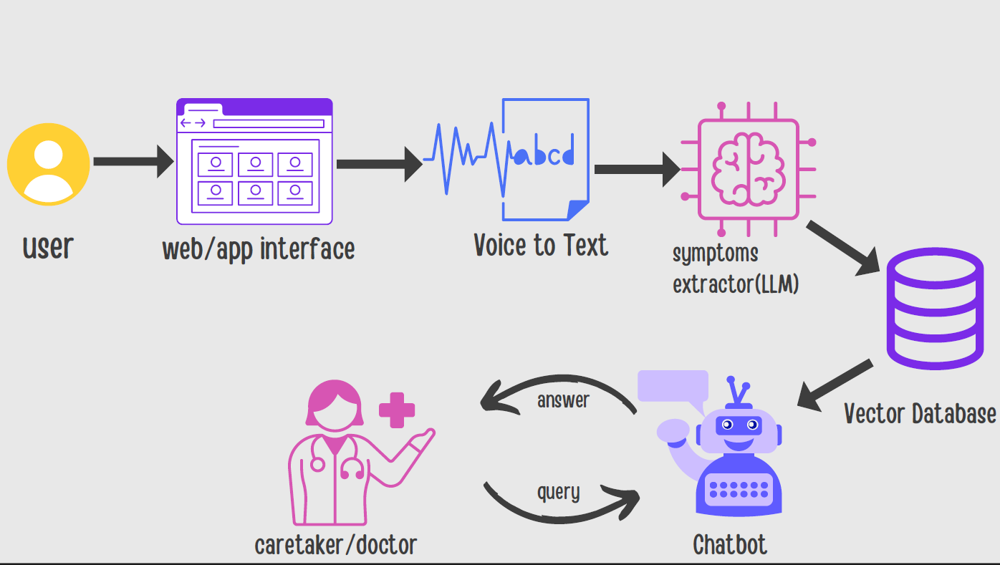

# Multilingual Symptom Collection and Management Bot

This project aims to streamline the process of symptom collection and management in healthcare by leveraging advanced AI technologies, including speech-to-text conversion, large language models (LLMs), and retrieval-augmented generation (RAG). The system is designed to assist healthcare providers in efficiently handling patient data in multiple languages.


## Key features

1. **Multilingual Symptom Collection**  
   - Input symptoms via voice or text in multiple languages.
   - Use of advanced speech-to-text APIs for accurate transcription.

2. **Symptom Extraction**  
   - Utilizes fine-tuned LLMs to identify and categorize symptoms from patient statements.

3. **Vectorized Data Storage**  
   - Stores symptoms and related patient data in a vector database using Pinecone.

4. **RAG-Based Chatbot**  
   - Enables healthcare providers to query patient data and receive real-time conversational responses.



## Installation

### Clone the Repository
```bash
git clone <repository_url>
cd symptom-management-bot
```

### Install Dependencies
Make sure you have Python 3.8 or later installed.

```bash
pip install transformers pinecone-client torch requests
```


## Usage
### 1. Initialize Pinecone
Sign up at [Pinecone](https://www.pinecone.io/), create an API key, and replace `YOUR_API_KEY` in the code.

```python
import pinecone
pinecone.init(api_key="YOUR_API_KEY", environment="us-west1-gcp")
index = pinecone.Index("patient-symptoms")
```
### 2. Store Patient Data
Insert patient symptom data into Pinecone after generating embeddings.

```python
from transformers import AutoTokenizer, AutoModel
import torch

# Load embedding model
tokenizer = AutoTokenizer.from_pretrained("sentence-transformers/all-MiniLM-L6-v2")
model = AutoModel.from_pretrained("sentence-transformers/all-MiniLM-L6-v2")

# Function to generate embeddings
def get_embedding(text):
    inputs = tokenizer(text, return_tensors="pt", truncation=True, padding=True)
    with torch.no_grad():
        return model(**inputs).last_hidden_state.mean(dim=1)[0].numpy()

# Insert data
index.upsert([
    ("patient_1", get_embedding("fever and headache"), {"symptoms": "fever and headache"}),
    ("patient_2", get_embedding("nausea and dizziness"), {"symptoms": "nausea and dizziness"})
])
```
### 3. Query the Chatbot
Use the chatbot to retrieve and analyze patient data.

```python
from transformers import pipeline

# Load language model
llm = pipeline("text-generation", model="meta-llama/Llama-2-7b-chat-hf")

# Query the chatbot
def chatbot(query):
    query_embedding = get_embedding(query)
    results = index.query(query_embedding, top_k=2, include_metadata=True)
    context = " ".join([match['metadata']['symptoms'] for match in results["matches"]])
    response = llm(f"Patient query: {query}\nRelevant symptoms: {context}\nAnswer:")
    return response[0]["generated_text"]

print(chatbot("I have headaches and fever"))
```

## Future Enhancements

1. Real-time monitoring of symptoms for proactive healthcare.
2. Integration with wearable devices and electronic health records.
3. Support for additional languages and dialects.

## Contributing

Contributions are welcome! Please open an issue or submit a pull request for any suggestions or improvements.

## License
This project is licensed under the MIT License. 
